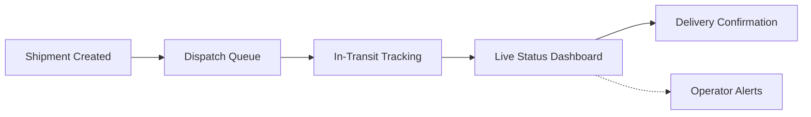

 

  

  

  

<code>
<a href="#profile">Profile</a> &nbsp;·&nbsp;
<a href="#competencies">Competencies</a> &nbsp;·&nbsp;
<a href="#stack">Stack</a> &nbsp;·&nbsp;
<a href="#portfolio">Portfolio</a> &nbsp;·&nbsp;
<a href="#engagement">Engagement</a> &nbsp;·&nbsp;
<a href="#analytics">Analytics</a> &nbsp;·&nbsp;
<a href="#connect">Connect</a>
</code>

 

## `001` · Profile

I engineer **frontend systems**, not just interfaces. My work sits at the intersection of component architecture, interaction design, and performance discipline — built with the assumption that every project outlives its first release.

I currently operate as an independent freelance developer while completing a BSc. (Hons) in Computing. That dual context matters: client work forces production-grade discipline, and formal study keeps the underlying fundamentals sharp.

<table>
<tr>
<td width="50%" valign="top">

**How I work**
- Design decisions are treated as engineering decisions
- Readable, boring code beats clever code
- Ship in small increments, measure before iterating
- Every component is built assuming someone else maintains it next

</td>
<td width="50%" valign="top">

**Where I'm headed**
- Deepening backend & API design fundamentals
- Studying system design at a production scale
- Moving from "frontend developer" to full-stack engineer
- Building one original product end-to-end, not just client work

</td>
</tr>
</table>

## `02` · Core Competencies

| Domain | Level | What that means in practice |
|---|:---:|---|
| **Frontend Architecture** | `████████░░` 85% | Component hierarchies that stay clean past 50+ components |
| **UI/UX Implementation** | `████████░░` 85% | Pixel-accurate design-to-code with attention to motion detail |
| **JavaScript / TypeScript** | `███████░░░` 75% | Modern ES patterns, async control flow, typed safety where it matters |
| **Performance Engineering** | `███████░░░` 70% | Bundle discipline, render efficiency, Core Web Vitals awareness |
| **Backend Fundamentals** | `█████░░░░░` 55% | Python & Java foundations, actively building toward full-stack |
| **Tooling & Workflow** | `████████░░` 80% | Git discipline, Figma-to-code pipelines, clean PR hygiene |

## `03` · Technical Stack

**Frontend**
 

 

**Languages**
 

 

**Tooling & Design**
 

## `04` · Engineering Portfolio

<b>🚚 Courier Nepal — Logistics & Shipment Management Platform</b>

 

A logistics dashboard managing the full shipment lifecycle from dispatch to delivery, built around real-time clarity under high data density.

| Attribute | Details |
|---|---|
| **Problem Solved** | Manual, fragmented shipment tracking → unified real-time dashboard |
| **Stack** | React, Tailwind CSS, component-driven architecture |
| **Engineering Focus** | Live state updates, responsive dashboard layout, progressive disclosure |
| **Design Priority** | Information hierarchy without overwhelming the operator |
| **Repository** | [github.com/samirjungthapa](https://github.com/samirjungthapa) |

**System overview:**

**Engineering notes:** The hard problem wasn't displaying data — it was displaying *enough* data without burying the signal. Solved through layered disclosure: summary state first, drill-down detail on demand.

<b>🛒 ThapaMart — E-Commerce Platform</b>

 

A storefront engineered around conversion-friendly browsing and a frictionless checkout path.

| Attribute | Details |
|---|---|
| **Problem Solved** | Slow, cluttered shopping flows → fast, focused purchase path |
| **Stack** | React, Tailwind CSS, responsive component library |
| **Engineering Focus** | Catalog performance, cart state management, checkout UX |
| **Design Priority** | Speed-to-purchase, mobile-first responsiveness |
| **Repository** | [github.com/samirjungthapa](https://github.com/samirjungthapa) |

**Engineering notes:** Built catalog, cart, and checkout as independently maintainable modules from day one — so scaling the product range later doesn't mean rebuilding the flow.

<b>🌐 Personal Developer Portfolio</b>

 

A personal showcase built to demonstrate craftsmanship through motion and interaction detail, not static presentation.

| Attribute | Details |
|---|---|
| **Problem Solved** | Generic template portfolios → a distinct, branded developer presence |
| **Stack** | React, Tailwind CSS, custom animation logic |
| **Engineering Focus** | Micro-interactions, performance-conscious motion, responsive layout |
| **Design Priority** | Brand consistency without sacrificing load time |
| **Repository** | [github.com/samirjungthapa](https://github.com/samirjungthapa) |

**Engineering notes:** Every animation was scoped to avoid layout thrash and unnecessary re-renders — the "premium feel" was a constraint to hit without a performance cost.

<b>💪 Gym Management System — Java Desktop Application</b>

 

An object-oriented desktop application modeling gym membership and subscription workflows.

| Attribute | Details |
|---|---|
| **Problem Solved** | Manual membership tracking → structured OOP-based system |
| **Stack** | Java, object-oriented design patterns |
| **Engineering Focus** | Class architecture, encapsulation, subscription state modeling |
| **Design Priority** | Clean separation across membership, billing, and admin logic |
| **Repository** | [github.com/samirjungthapa](https://github.com/samirjungthapa) |

**Engineering notes:** Used as a deliberate exercise in translating real business rules — membership tiers, renewals, cancellations — into clean, extensible class hierarchies.

## `05` · Freelance Engagement

**Independent Frontend Developer** — Freelance
`2023 — Present`

Delivering end-to-end frontend builds for logistics, e-commerce, and personal-brand clients — from architecture through deployment.

- Translate design requirements directly into scalable, component-based React applications
- Own the full delivery cycle: architecture, build, responsiveness, and performance tuning
- Structure code for future feature growth rather than one-off delivery
- Fold client feedback into iterative, production-ready releases without breaking existing structure

`React` `Tailwind CSS` `JavaScript` `Responsive Design` `Client Delivery`

## `06` · Roadmap

| Status | Milestone |
|:---:|---|
| ✅ | Establish professional GitHub & portfolio presence |
| ✅ | Ship first production-grade freelance projects |
| 🔄 | Launch Courier Nepal V2 with expanded feature set |
| 🔄 | Scale ThapaMart into a full-featured storefront |
| ⏳ | Formalize backend development skillset |
| ⏳ | Transition into full-stack engineering roles |
| ⏳ | Contribute to open-source projects |
| ⏳ | Design and ship an original SaaS product |

## `07` · GitHub Analytics

 

## `08` · Trophies

## `09` · Contribution Activity

## `10` · Connect

  

*"Senior engineering isn't writing more code — it's writing code that costs less to change tomorrow."*

